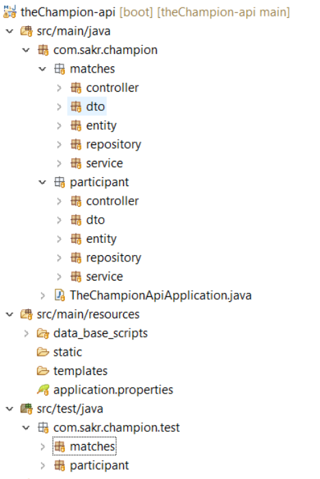

 
# TheChampion-api:
  * ##### About 
  * ##### Code Architecture : 
  * ##### How to build  and run.
  
### About: 
 It's a spring-boot  with spring-data-jpa application which defines tennis-table league .

### Code Architecture: 

* ##### It is consits of two modules :
 Participant moudle and Matches module :
Eeach module have it's own packages as follows : 
*  Conroller : Contains the rest End Points of the project.  
* Dto : The Data Transferobjects of the module.
* Servcice: Service Class which have all the logic of the module.
* Repositiory : The Database layer of the project.
* Entity: Database Entites.
 
#### How to build  and run:  
**Pull the project and create mvn clean instal :** 
  > git pull <repoURL> 
   
  > mvn clean install 
  
  Then run as a spring boot application then go to:
  localost:8090
  
 
 

 
